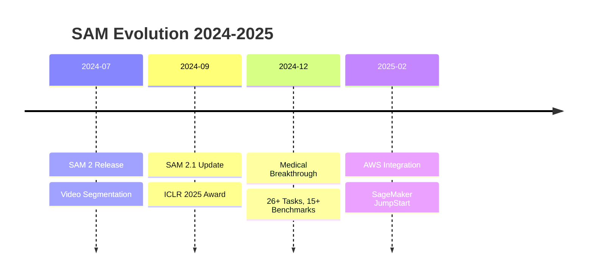

<div align="center">

# 🎯 Awesome SAM Foundation Models
### *Comprehensive Resource Collection for Segment Anything*

[](https://awesome.re)
[](https://github.com/umitkacar/SAM-Foundation-Models/stargazers)
[](https://github.com/umitkacar/SAM-Foundation-Models/network/members)
[](https://github.com/umitkacar/SAM-Foundation-Models/watchers)


[](http://makeapullrequest.com)
[](https://github.com/umitkacar/SAM-Foundation-Models)

### 🚀 Curated collection of SAM resources, implementations, optimizations & applications
#### Updated with 2024-2025 SOTA developments

---

[📖 Explore](#-table-of-contents) • [🔥 Latest Updates](#-official-models--latest-updates) • [💡 Applications](#-domain-specific-applications) • [🛠️ Tools](#-production-deployment--tools) • [📚 Learn](#-educational-resources--tutorials)

---

</div>

## 🌟 Highlights

<table>
<tr>
<td width="33%" align="center">
<h3>⚡ 6x Faster</h3>
<p>SAM 2 processes images<br/>6x faster than original SAM</p>
</td>
<td width="33%" align="center">
<h3>🎯 3x Efficient</h3>
<p>Requires 3x fewer<br/>user interactions</p>
</td>
<td width="33%" align="center">
<h3>📱 30+ FPS</h3>
<p>Real-time on mobile<br/>devices (EdgeSAM)</p>
</td>
</tr>
<tr>
<td width="33%" align="center">
<h3>🏆 ICLR 2025</h3>
<p>Best Paper<br/>Honorable Mention</p>
</td>
<td width="33%" align="center">
<h3>🎬 44 FPS</h3>
<p>Real-time video<br/>segmentation</p>
</td>
<td width="33%" align="center">
<h3>🏥 26+ Tasks</h3>
<p>Medical imaging<br/>benchmarks</p>
</td>
</tr>
</table>

---

## 📑 Table of Contents

<details open>
<summary><b>Click to expand/collapse</b></summary>

- [🔥 Official Models & Latest Updates](#-official-models--latest-updates)
- [🎬 SAM 2 & Video Segmentation](#-sam-2--video-segmentation)
- [⚡ Optimization & Mobile Deployment](#-optimization--mobile-deployment)
- [📚 Academic Research & Surveys](#-academic-research--surveys)
- [💡 Domain-Specific Applications](#-domain-specific-applications)
  - [🏥 Medical Imaging](#-medical-imaging-2024-2025)
  - [🛰️ Remote Sensing & Agriculture](#️-remote-sensing--agriculture)
  - [🚗 Autonomous Driving & Robotics](#-autonomous-driving--robotics)
  - [🏭 Industrial Quality Control](#-industrial-quality-control)
- [🎓 Training & Fine-Tuning](#-training--fine-tuning)
- [🛠️ Production Deployment & Tools](#️-production-deployment--tools)
- [🔧 SAM Extensions & Variants](#-sam-extensions--variants)
- [💻 Implementation Libraries](#-implementation-libraries)
- [📊 Datasets & Benchmarks](#-datasets--benchmarks)
- [📖 Educational Resources](#-educational-resources--tutorials)
- [🎯 Key Insights & Trends](#-key-insights--trends-2024-2025)

</details>

---

## 🔥 Official Models & Latest Updates

<div align="center">

### 🎯 Meta's Official SAM Family

</div>

<details open>
<summary><b>🌟 SAM 2.1 - Latest Release (September 2024)</b></summary>

<br/>

| Feature | Performance | Status |
|---------|-------------|--------|
| 🚀 Speed | **6x faster** than SAM 1 | ✅ Released |
| 🎯 Efficiency | **3x fewer** interactions | ✅ Stable |
| 🎬 Video FPS | **44 FPS** real-time | ✅ Production |
| 📜 License | Apache 2.0 | ✅ Open Source |
| 🏆 Recognition | ICLR 2025 Best Paper | ✅ Awarded |

#### 📥 Official Resources

```bash
# Install SAM 2
pip install segment-anything-2

# Quick Start
from sam2 import SAM2Model
model = SAM2Model.from_pretrained("facebook/sam2-hiera-large")
```

**Links:**
- 📦 [GitHub Repository](https://github.com/facebookresearch/sam2) 
- 📝 [Meta AI Blog](https://ai.meta.com/blog/segment-anything-2/)
- 📄 [Research Paper - ArXiv:2408.00714](https://arxiv.org/abs/2408.00714)
- 🤗 [HuggingFace Hub](https://huggingface.co/facebook/sam2-hiera-large) - 182K+ downloads/month
- ☁️ [AWS SageMaker JumpStart](https://ai.meta.com/blog/segment-anything-2/) - Feb 2025

</details>

<details>
<summary><b>🎨 Original SAM (April 2023)</b></summary>

<br/>

- 🏠 [Official Website](https://segment-anything.com/)
- 📦 [GitHub Repository](https://github.com/facebookresearch/segment-anything) 
- 📄 [Paper - ArXiv:2304.02643](https://arxiv.org/abs/2304.02643)
- 🎯 [Papers with Code](https://paperswithcode.com/paper/segment-anything)

</details>

<details>
<summary><b>🔗 Integration Platforms</b></summary>

<br/>

| Platform | Features | Link |
|----------|----------|------|
| 🤖 **Ultralytics** | Production-ready YOLO integration | [Docs](https://docs.ultralytics.com/models/sam-2/) |
| 🤗 **HuggingFace** | Model hub, Transformers support | [Hub](https://huggingface.co/facebook/sam2-hiera-large) |
| ☁️ **SageMaker** | AWS deployment ready | [JumpStart](https://ai.meta.com/blog/segment-anything-2/) |

</details>

---

## 🎬 SAM 2 & Video Segmentation

### 🌟 Advanced Video Segmentation (2024-2025)

<table>
<tr>
<td width="50%">

#### 🏆 [SAM2Long](https://github.com/Mark12Ding/SAM2Long)
**ICCV 2025** | 

- 🎯 Training-free memory tree
- 🔄 Long video segmentation
- 🎭 Handles occlusion/reappearance
- 📊 [Project Page](https://mark12ding.github.io/project/SAM2Long/)

</td>
<td width="50%">

#### 🔥 [Grounded-SAM-2](https://github.com/IDEA-Research/Grounded-SAM-2)
**Multi-modal Integration** | 

- 🤝 Grounding DINO + Florence-2 + SAM 2
- 🎯 Detect + Segment + Track
- 🎬 Video object tracking
- 🌐 HuggingFace ready

</td>
</tr>
<tr>
<td width="50%">

#### 🎤 [AL-Ref-SAM2](https://github.com/appletea233/AL-Ref-SAM2)
**AAAI 2025** | 

- 🔊 Audio-Language-Referenced VOS
- 🧠 GPT temporal-spatial reasoning
- 🎯 Training-free paradigm
- 🚀 State-of-the-art results

</td>
<td width="50%">

#### 🏥 [Surgical SAM 2](https://github.com/jinlab-imvr/Surgical-SAM-2)
**NeurIPS 2024** | 

- ⚡ **86 FPS** real-time
- 🏥 Medical surgery segmentation
- 💪 3x faster performance
- 📱 Resource-constrained ready

</td>
</tr>
</table>

### 📼 Classic Video & Tracking

- 🎯 [Segment-and-Track-Anything](https://github.com/z-x-yang/Segment-and-Track-Anything) 
- ⚡ [RAP-SAM](https://github.com/xushilin1/rap-sam) - Real-Time All-Purpose on Video

---

## ⚡ Optimization & Mobile Deployment

<div align="center">

### 📱 Edge & Mobile Champions

</div>

<table>
<tr>
<th width="25%">Model</th>
<th width="15%">Speed</th>
<th width="15%">Size</th>
<th width="15%">Device</th>
<th width="30%">Highlights</th>
</tr>
<tr>
<td><b>🚀 EdgeSAM</b></td>
<td><b>30+ FPS</b></td>
<td>-</td>
<td>iPhone 14</td>
<td>First mobile SAM @ 30+ FPS</td>
</tr>
<tr>
<td><b>⚡ EfficientSAM</b></td>
<td>10-20 img/s</td>
<td><b>9.8M</b></td>
<td>Edge</td>
<td>Best accuracy-efficiency trade-off</td>
</tr>
<tr>
<td><b>📱 MobileSAM</b></td>
<td><b>40x</b></td>
<td><b>60x smaller</b></td>
<td>Mobile</td>
<td>Lightweight variant</td>
</tr>
<tr>
<td><b>🏃 FastSAM</b></td>
<td><b>~100 img/s</b></td>
<td>68M</td>
<td>GPU</td>
<td>Maximum throughput</td>
</tr>
</table>

<details>
<summary><b>📊 Performance Comparison: EfficientSAM vs FastSAM</b></summary>

<br/>

| Metric | EfficientSAM-Ti | EfficientSAM-S | FastSAM |
|--------|-----------------|----------------|---------|
| **COCO AP** | 45.0 (+4.1) | - (+6.5) | 37.0 |
| **LVIS AP** | - (+5.3) | - (+7.8) | - |
| **Params** | **9.8M** | - | 68M |
| **Speed** | 10-20 img/s | 10-20 img/s | ~100 img/s |

**Winner:** 🏆 EfficientSAM for accuracy, 🏆 FastSAM for speed

</details>

### 🛠️ Optimization Resources

<details>
<summary><b>Click to see optimization tools & papers</b></summary>

#### 📚 Papers & Surveys
- 📄 [ArXiv: On Efficient Variants of SAM](https://arxiv.org/html/2410.04960v1) (2024)
- 🔍 [Awesome-Efficient-Segment-Anything](https://github.com/czg1225/Awesome-Efficient-Segment-Anything)

#### 🔗 Repositories

| Model | Link | Special Feature |
|-------|------|-----------------|
| 🚀 **EdgeSAM** | [GitHub](https://github.com/chongzhou96/EdgeSAM) • [Paper](https://arxiv.org/abs/2312.06660) | CNN-based, iPhone ready |
| ⚡ **EfficientSAM** | [GitHub](https://github.com/yformer/EfficientSAM) • [Site](https://yformer.github.io/efficient-sam/) | Best AP/params ratio |
| 📱 **MobileSAM** | [GitHub](https://github.com/ChaoningZhang/MobileSAM) | 60x compression |
| 🏃 **FastSAM** | [GitHub](https://github.com/CASIA-IVA-Lab/FastSAM) • [Docs](https://docs.ultralytics.com/models/fast-sam/) | Prompt-free |
| 🔬 **TinySAM** | [GitHub](https://github.com/xinghaochen/TinySAM) | Ultra-compact |
| 💎 **HQ-SAM** | [GitHub](https://github.com/SysCV/sam-hq) | NeurIPS 2023, Quality++ |

</details>

---

## 📚 Academic Research & Surveys

<div align="center">

### 📖 Comprehensive Surveys (2024-2025)

</div>

<details open>
<summary><b>🌟 Must-Read Surveys</b></summary>

<br/>

#### 📘 [A Survey on SAM: Vision Foundation Model Meets Prompt Engineering](https://arxiv.org/abs/2306.06211)
**ArXiv:2306.06211** • Updated: Oct 2024 • 🏆 Most Comprehensive

```
📅 Coverage: April 2023 - September 2024
🎯 Topics: SAM & SAM 2, Prompt Engineering
📊 Papers: 200+ analyzed
⭐ Rating: ⭐⭐⭐⭐⭐
```

#### 📗 [A Comprehensive Survey on SAM for Vision and Beyond](https://arxiv.org/abs/2305.08196)
**ArXiv:2305.08196** • Foundation model analysis

```
🎯 Topics: Computer Vision Applications
🔬 Depth: Technical Deep Dive
📊 Applications: Multiple Domains
```

#### 📙 [Segment Anything for Video: Past to Future](https://arxiv.org/abs/2507.22792)
**ArXiv:2507.22792** • 2025 • Video-specific review

```
🎬 Focus: Video Object Segmentation & Tracking
⏰ Timeline: Past → Present → Future
🎯 Comprehensive VOST analysis
```

</details>

<details>
<summary><b>🗂️ Curated Collections</b></summary>

<br/>

| Repository | Description | Stars |
|------------|-------------|-------|
| 📚 [Awesome-Segment-Anything](https://github.com/liliu-avril/Awesome-Segment-Anything) | First comprehensive survey |  |
| 🎬 [Awesome-SAM2](https://github.com/GuoleiSun/Awesome-SAM2) | SAM 2 specific resources |  |
| 🏥 [SAM4MIS](https://github.com/YichiZhang98/SAM4MIS) | Medical imaging collection |  |

#### 📑 Paper Lists
- 📄 [2024 Paper List](https://github.com/liliu-avril/Awesome-Segment-Anything/blob/main/Paper_List/paper_list_2024.md) - Continuously updated

</details>

---

## 💡 Domain-Specific Applications

### 🏥 Medical Imaging (2024-2025)

<table>
<tr>
<td width="50%">

#### 🩺 [SAM4MIS](https://github.com/YichiZhang98/SAM4MIS)
**CIBM 2024** | 

**Benchmarks:**
- ✅ 15+ medical benchmarks
- ✅ 26+ different tasks
- 🔬 Mammography, MRI, CT
- 👁️ Retinal vessel segmentation
- 🫀 Ultrasound imaging

</td>
<td width="50%">

#### 🧊 [SAM-Med3D](https://link.springer.com/chapter/10.1007/978-3-031-91721-9_4)
**General-purpose 3D Medical Segmentation**

**Dataset:**
- 📦 SA-Med3D-140K
- 🎯 22K 3D images
- 🏷️ 143K masks
- 🔬 Multi-modal (CT, MRI, etc.)
- 🎯 Few-shot 3D prompting

</td>
</tr>
</table>

<details>
<summary><b>🔬 More Medical Applications</b></summary>

<br/>

#### 🎯 Key Papers (2024-2025)

| Paper | Venue | Application | Performance |
|-------|-------|-------------|-------------|
| [Interactive 3D Medical Segmentation](https://arxiv.org/html/2408.02635v2) | ArXiv 2024 | Zero-shot 3D CT | State-of-art |
| [SAM 2 for 3D Medical Imaging](https://ai.jmir.org/2025/1/e72109/) | JMIR AI 2025 | Abdominal CT scans | Promising |
| [ProtoSAM-3D](https://pubmed.ncbi.nlm.nih.gov/39919534/) | PubMed | Volumetric imaging | Interactive |
| [AutoProSAM](https://openaccess.thecvf.com/content/WACV2025/papers/Li_AutoProSAM_Automated_Prompting_SAM_for_3D_Multi-Organ_Segmentation_WACV_2025_paper.pdf) | WACV 2025 | Multi-organ 3D | Automated |
| [SAM-Med2D Analysis](https://bmcmedimaging.biomedcentral.com/articles/10.1186/s12880-024-01401-6) | BMC 2024 | 2D Medical images | Improved |

#### 📖 Reviews
- 📚 [Review: SAM for Medical Imaging](https://pubmed.ncbi.nlm.nih.gov/39673905/) - Comprehensive 2025 review

</details>

### 🛰️ Remote Sensing & Agriculture

<details>
<summary><b>🌾 Agricultural Applications</b></summary>

<br/>

#### 🛰️ [SAMGeo](https://cfp.scipy.org/2024/talk/ZPBYF7/)
**SciPy 2024 Presentation**

- 🌍 Automated remote sensing segmentation
- 📦 Open-source geospatial package
- 🎯 User-friendly API

#### 🌱 [SAM for Crop Mapping](https://www.mdpi.com/2072-4292/16/9/1505)
**MDPI Remote Sensing 2024**

```python
# Automated sample generation
✅ Sentinel-2 imagery (10m resolution)
✅ Landsat-8 support (30m resolution)
✅ Automatic quality filtering
✅ Sample cleaning pipeline
```

#### 🚜 [Can SAM Recognize Crops?](https://arxiv.org/html/2311.15138v2)
**ArXiv 2023** | Zero-shot Performance Evaluation

- 🎯 Crop-type mapping
- 📊 Precision agriculture
- 🔍 Zero-shot capabilities
- 🌾 Multi-spectral challenges

#### 🗺️ [ESRI ArcGIS Integration](https://www.esri.com/arcgis-blog/products/arcgis-pro/geoai/revolutionizing-image-segmentation-with-sam-segment-anything-model/)

- 🏙️ Urban planning
- 🌲 Environmental monitoring
- 💧 Water body extraction
- 🏗️ Infrastructure mapping

</details>

### 🚗 Autonomous Driving & Robotics

<details>
<summary><b>🤖 Robotics & AV Applications</b></summary>

<br/>

#### 🚙 [SAMUNet](https://www.sciencedirect.com/science/article/abs/pii/S0262885625002914)
**2025** | Shape-aware 3D Object Detection

- 🎯 Pillar-based detection
- 🚗 Autonomous driving optimized
- 📊 Enhanced 3D understanding

#### ☁️ Point Cloud Resources

- 📊 [7 SOTA Point Cloud Models](https://segments.ai/blog/7-state-of-the-art-3d-point-cloud-models-for-autonomous-driving/)
- 🎯 LiDAR-based detection
- 🤖 Robotic perception
- 🌐 3D scene understanding

**Applications:**
```
✅ 3D Object Detection
✅ Semantic Segmentation
✅ Instance Segmentation
✅ Panoptic Segmentation
```

</details>

### 🏭 Industrial Quality Control

<details>
<summary><b>🔍 Defect Detection & QC</b></summary>

<br/>

#### ⚙️ [Weld Defect Detection with SAM](https://www.mdpi.com/1424-8220/25/1/277)
**MDPI Sensors 2025**

```yaml
Application: Oil & Gas Pipeline Inspection
Method: Ultrasonic B-scan Analysis
Models: SAM 1 (ViT-Base) + SAM 2 (Hiera-Base+)
Performance: F1-Score 0.940
Defect Type: Lack of Fusion (LOF)
```

#### 🔧 [Armature Defect Detection](https://www.mdpi.com/2227-9717/13/2/532)
**MDPI Processes 2025** | YOLO11 + SAM

- 🎯 Micro-vibration motor QC
- 🤖 YOLO11 detection + SAM segmentation
- 📊 Quantitative severity assessment
- ✅ **90%+ accuracy**
- ⚡ Real-time capable

**Benefits:**
```
✅ Automated inspection
✅ Cost-effective solution
✅ Real-time analysis
✅ Quantitative metrics
```

</details>

### 🎨 Specialized Domains

<details>
<summary><b>🌈 Other Applications</b></summary>

<br/>

| Domain | Project | Description |
|--------|---------|-------------|
| 📏 **Depth** | [Depth-Anything-V2](https://huggingface.co/spaces/depth-anything/Depth-Anything-V2) | Monocular depth estimation |
| 🎮 **3D Gaussian** | [gaussian-grouping](https://github.com/lkeab/gaussian-grouping) | 3D Gaussian splatting |
| 🏗️ **3D Recon** | [garfield](https://github.com/chungmin99/garfield) | 3D reconstruction |
| 🔷 **Mesh** | [MeshAnything](https://github.com/buaacyw/MeshAnything) | 3D mesh generation |
| 🎬 **4D** | [SA4D](https://github.com/hustvl/SA4D) | 4D scene understanding |
| 📝 **OCR** | [OCR-SAM](https://github.com/yeungchenwa/OCR-SAM) | Text recognition |
| 🍕 **Food** | [FOOD-SAM](https://github.com/jamesjg/foodsam) | Food segmentation |
| 📸 **Deblur** | [SAM-Deblur](https://github.com/hplqaq/sam-deblur) | Image deblurring |

</details>

---

## 🎓 Training & Fine-Tuning

<div align="center">

### 🧬 Fine-Tuning Frameworks & LoRA Adapters

</div>

<details open>
<summary><b>🔧 Top Fine-Tuning Repositories</b></summary>

<br/>

<table>
<tr>
<th>Repository</th>
<th>Method</th>
<th>Domain</th>
<th>Updated</th>
</tr>
<tr>
<td><a href="https://github.com/mazurowski-lab/finetune-SAM"><b>finetune-SAM</b></a></td>
<td>LoRA + Full</td>
<td>🏥 Medical</td>
<td>✅ 2024</td>
</tr>
<tr>
<td><a href="https://github.com/WangRongsheng/SAM-fine-tune"><b>SAM-fine-tune</b></a> 🌌</td>
<td>LoRA</td>
<td>🌐 General</td>
<td>✅ Active</td>
</tr>
<tr>
<td><a href="https://github.com/michael11albrecht/lora_sam"><b>lora_sam</b></a></td>
<td>LoRA + 🤗</td>
<td>🎯 Vision</td>
<td>✅ 2024</td>
</tr>
<tr>
<td><a href="https://github.com/hitachinsk/SAMed"><b>SAMed</b></a></td>
<td>LoRA</td>
<td>🏥 Medical</td>
<td>✅ Stable</td>
</tr>
<tr>
<td><a href="https://github.com/vpulab/med-sam-brain"><b>med-sam-brain</b></a></td>
<td>PEFT + LoRA</td>
<td>🧠 Brain Tumor</td>
<td>✅ 2024</td>
</tr>
</table>

</details>

<details>
<summary><b>📚 Tutorials & Learning Resources</b></summary>

<br/>

#### 🎯 Official Tutorials

| Resource | Level | Topics |
|----------|-------|--------|
| [Labellerr: SAM + LoRA](https://www.labellerr.com/blog/sam-fine-tuning-using-lora/) | 🟢 Beginner | One-shot learning, ship segmentation |
| [Encord: Fine-Tune Guide](https://encord.com/blog/learn-how-to-fine-tune-the-segment-anything-model-sam/) | 🟡 Intermediate | Complete pipeline, best practices |
| [Medium: PEFT for Segmentation](https://medium.com/@nischaydiwan1026/exploring-parameter-efficient-fine-tuning-for-foundation-models-in-image-segmentation-49a7701a012a) | 🟡 Intermediate | Parameter-efficient methods |

#### 📄 Research Papers

- 🔬 [Conv-LoRA](https://openreview.net/forum?id=ezscMer8L0) - OpenReview
  - Lightweight convolutional parameters
  - Combined with LoRA
  - Enhanced performance

#### 💡 Quick Start Example

```python
from transformers import SamModel, SamProcessor
from peft import LoraConfig, get_peft_model

# Load base model
model = SamModel.from_pretrained("facebook/sam-vit-base")

# Configure LoRA
lora_config = LoraConfig(
    r=16,
    lora_alpha=32,
    target_modules=["qkv"],
    lora_dropout=0.05,
)

# Apply LoRA
model = get_peft_model(model, lora_config)

# Fine-tune on your data
# ... training code ...
```

</details>

---

## 🛠️ Production Deployment & Tools

### 🏷️ Annotation Tools with SAM Integration

<table>
<tr>
<td width="50%">

#### ✨ [CVAT](https://www.cvat.ai)
**Computer Vision Annotation Tool**

**SAM 2 Integration (2024):**
- 🎬 Video annotation @ **44 FPS**
- 🎯 Semi-automatic segmentation
- 🚀 Real-time object tracking
- 🖱️ Interactive prompting

**Resources:**
- 📝 [SAM 2 Video Annotation](https://www.cvat.ai/resources/blog/video-annotation-sam-2)
- 🖼️ [SAM 2 Image Segmentation](https://www.cvat.ai/resources/blog/meta-segment-anything-model-v2-is-now-available-in-cvat-ai)

</td>
<td width="50%">

#### 🏷️ [Label Studio](https://labelstud.io)
**ML Data Labeling Platform**

**Features:**
- 🤗 HuggingFace Spaces integration
- 🌐 Multi-modal (image, video, text, audio)
- 🔐 SSO & RBAC
- ☁️ Cloud-native ML pipelines
- 🐳 Docker/Kubernetes deployment

**Resources:**
- 📝 [SAM in HuggingFace Spaces](https://labelstud.io/blog/segment-anything-in-hugging-face-spaces/)

</td>
</tr>
</table>

<details>
<summary><b>📊 CVAT vs Label Studio Comparison</b></summary>

<br/>

| Feature | CVAT | Label Studio |
|---------|------|--------------|
| **Best For** | Video annotation, beginners | Enterprise, multi-modal |
| **SAM Integration** | ✅ SAM 2 native | ✅ Via HuggingFace |
| **Video Tools** | ⭐⭐⭐⭐⭐ | ⭐⭐⭐ |
| **Enterprise** | ⭐⭐⭐ | ⭐⭐⭐⭐⭐ |
| **Ease of Use** | ⭐⭐⭐⭐⭐ | ⭐⭐⭐⭐ |
| **ML Pipeline** | ⭐⭐⭐ | ⭐⭐⭐⭐⭐ |
| **Pricing** | Free + Enterprise | Free + Enterprise |

</details>

<details>
<summary><b>🔧 Other Annotation Tools</b></summary>

<br/>

- 🖥️ [AnyLabeling](https://github.com/vietanhdev/anylabeling) - Desktop labeling with SAM
- 🧂 [SALT](https://github.com/anuragxel/salt) - Segment Anything Labelling Tool

</details>

### ☁️ Deployment Platforms

<details>
<summary><b>🚀 Deployment Options</b></summary>

<br/>

#### 🤗 HuggingFace Ecosystem

```python
# Install transformers
pip install transformers

# Use SAM with transformers
from transformers import SamModel, SamProcessor

model = SamModel.from_pretrained("facebook/sam-vit-huge")
processor = SamProcessor.from_pretrained("facebook/sam-vit-huge")
```

**Resources:**
- 📚 [Official Docs](https://huggingface.co/docs/transformers/en/model_doc/sam)
- 🎯 [Models Hub](https://huggingface.co/models?other=sam)
- 🚀 [Jozu MLOps: HF to Production](https://jozu.com/blog/from-hugging-face-to-production-deploying-segment-anything-sam-with-jozus-model-import-feature/)

#### 🔄 Export & Conversion Tools

| Tool | Format | Features |
|------|--------|----------|
| [SAM2ONNX](https://github.com/DmitryYurov/SAM2ONNX) | ONNX | SAM 2 converter |
| [sam_onnx_full_export](https://github.com/AndreyGermanov/sam_onnx_full_export) | ONNX | Complete export |
| [sam4onnx](https://github.com/PINTO0309/sam4onnx) | ONNX | Optimization |
| [samexporter](https://github.com/vietanhdev/samexporter) | Multi | Multi-format |

</details>

---

## 🔧 SAM Extensions & Variants

### 🎯 Grounding & Multi-Modal

<details open>
<summary><b>🔥 Popular Extensions</b></summary>

<br/>

#### 🌟 [Grounded-Segment-Anything](https://github.com/IDEA-Research/Grounded-Segment-Anything)


**The Ultimate Combo:**
```
🎯 Grounding DINO (Detection)
    ↓
🎨 SAM (Segmentation)
    ↓
🖼️ Stable Diffusion (Generation)
    ↓
✨ Detect → Segment → Generate ANYTHING
```

**Features:**
- ✅ Text-to-detection
- ✅ Automatic segmentation
- ✅ Image inpainting
- ✅ HuggingFace integration

#### 🛡️ [RobustSAM](https://github.com/robustsam/RobustSAM)
**CVPR 2024** | Adversarial Robustness

- 🔒 Robust to adversarial attacks
- 🎯 Enhanced generalization
- 📊 Better performance on corrupted images

#### 🎨 [Personalize-SAM](https://github.com/ZrrSkywalker/Personalize-SAM)
**DreamBooth Integration**

- 🎭 Personalized segmentation
- 🤗 [Transformers Tutorial](https://github.com/NielsRogge/Transformers-Tutorials/tree/master/PerSAM)
- 📊 [vs Mask R-CNN](https://encord.com/blog/mask-rcnn-vs-per-sam/)

</details>

<details>
<summary><b>🧩 Full Pipeline Solutions</b></summary>

<br/>

| Project | Description | Key Feature |
|---------|-------------|-------------|
| [SEEM](https://github.com/UX-Decoder/Segment-Everything-Everywhere-All-At-Once) | Segment Everything Everywhere | Universal segmentation |
| [Full-SAM](https://github.com/ByungKwanLee/Full-Segment-Anything) | Complete pipeline | End-to-end solution |
| [AUTODISTILL](https://github.com/autodistill/autodistill) | Auto labeling | Dataset generation |
| [GroundingDINO](https://github.com/IDEA-Research/GroundingDINO) | Language grounding | Text-guided detection |
| [RAM](https://github.com/xinyu1205/recognize-anything/tree/main) | Recognize Anything | Image tagging |
| [CLIP](https://github.com/OpenAI/CLIP) | Vision-Language | Foundation model |

</details>

---

## 💻 Implementation Libraries

### 🔤 Multi-Language Support

<details>
<summary><b>⚙️ C++ Implementations</b></summary>

<br/>

| Repository | Framework | Platform |
|------------|-----------|----------|
| [segment-anything-cpp-wrapper](https://github.com/dinglufe/segment-anything-cpp-wrapper) | Pure C++ | Cross-platform |
| [sam-cpp-macos](https://github.com/ryouchinsa/sam-cpp-macos) | Extended | macOS |
| [sam.cpp](https://github.com/YavorGIvanov/sam.cpp) | GGML | Multi-platform |
| [SegmentAnything-OnnxRunner](https://github.com/OroChippw/SegmentAnything-OnnxRunner) | ONNX | Cross-platform |
| [SAM-ONNX-AX650-CPP](https://github.com/ZHEQIUSHUI/SAM-ONNX-AX650-CPP) | QT + Lama | GUI + Inpaint |

</details>

<details>
<summary><b>🔷 Other Languages</b></summary>

<br/>

#### C#
- 💎 [SamSharp](https://github.com/thislookshard/SamSharp) - C# implementation

#### Rust 🦀
- ⚡ [sam_onnx_rust](https://github.com/AndreyGermanov/sam_onnx_rust) - Rust ONNX

#### LibTorch 🔥
- 🎯 [Libtorch-MobileSAM-Example](https://github.com/cyrillkuettel/Libtorch-MobileSAM-Example) - C++ PyTorch

</details>

<details>
<summary><b>📱 Mobile Runtimes</b></summary>

<br/>

#### MNN Framework
- 📱 [EdgeSAM-MNN](https://github.com/slz929/EdgeSAM-MNN) - EdgeSAM on MNN
- 🚀 [mnn-segment-anything](https://github.com/wangzhaode/mnn-segment-anything) - Mobile Neural Network

</details>

<details>
<summary><b>🎨 Creative Tools Integration</b></summary>

<br/>

#### ComfyUI
- 🎭 [comfyui_segment_anything](https://github.com/storyicon/comfyui_segment_anything) - SAM nodes for ComfyUI workflow

</details>

---

## 📊 Datasets & Benchmarks

<div align="center">

### 🗄️ Official Meta Datasets

</div>

<table>
<tr>
<th width="50%">SA-1B (Images)</th>
<th width="50%">SA-V (Videos)</th>
</tr>
<tr>
<td>

**📦 [SA-1B Dataset](https://ai.meta.com/datasets/segment-anything/)**

```yaml
Images: 11 Million
Masks: 1+ Billion
Type: Open world images
License: Licensed & privacy-respecting
Status: ✅ Released 2023
```

**Superlatives:**
- 🏆 Largest segmentation dataset
- 🌍 Diverse geography
- 🎯 High-quality annotations

</td>
<td>

**🎬 [SA-V Dataset](https://encord.com/blog/segment-anything-model-2-sam-2/)**

```yaml
Videos: 51,000
Countries: 47
Masks: 600,000+
Resolution: 240p → 4K
Duration: 4s → 138s
Status: ✅ Released 2024
```

**Features:**
- 🌍 Global diversity
- 🎥 Multi-resolution
- ⏱️ Variable length

</td>
</tr>
</table>

### 🎯 Benchmark Datasets

<details>
<summary><b>📊 SAM 2 Evaluation Benchmarks</b></summary>

<br/>

| Benchmark | Task | Metrics |
|-----------|------|---------|
| **DAVIS** | Video object segmentation | J&F score |
| **MOSE** | Multi-object segmentation | J&F score |
| **LVOS** | Long-term video segmentation | Success rate |
| **YouTube-VOS** | Large-scale video | J&F score |
| **COCO** | Instance segmentation | AP, AR |
| **LVIS** | Large vocabulary segmentation | AP, APr |

**SAM 2 Performance:**
```
✅ 3x fewer interactions
✅ Better accuracy
✅ 6x faster inference
✅ SOTA on all benchmarks
```

</details>

---

## 📖 Educational Resources & Tutorials

<div align="center">

### 🎓 Learn SAM from Scratch to Production

</div>

### 📚 Comprehensive Guides

<details open>
<summary><b>🌟 Must-Read Tutorials</b></summary>

<br/>

<table>
<tr>
<th>Resource</th>
<th>Level</th>
<th>Topics</th>
<th>Link</th>
</tr>
<tr>
<td>🎯 <b>Encord Ultimate Guide</b></td>
<td>🟢 All</td>
<td>Architecture, Training, Applications</td>
<td><a href="https://encord.com/blog/segment-anything-model-explained/">Read</a></td>
</tr>
<tr>
<td>🤖 <b>Roboflow Breakdown</b></td>
<td>🟢 Beginner</td>
<td>Concepts, Use Cases</td>
<td><a href="https://blog.roboflow.com/segment-anything-breakdown/">Read</a></td>
</tr>
<tr>
<td>🛠️ <b>Roboflow How-to</b></td>
<td>🟡 Intermediate</td>
<td>Practical Implementation</td>
<td><a href="https://blog.roboflow.com/how-to-use-segment-anything-model-sam/">Read</a></td>
</tr>
<tr>
<td>🏷️ <b>V7 Labs Guide</b></td>
<td>🟢 All</td>
<td>Complete Overview</td>
<td><a href="https://www.v7labs.com/blog/segment-anything-model-sam">Read</a></td>
</tr>
<tr>
<td>👨‍💻 <b>LabelVisor Hands-on</b></td>
<td>🟡 Intermediate</td>
<td>Effortless Segmentation</td>
<td><a href="https://www.labelvisor.com/effortless-segmentation-in-seconds-a-hands-on-guide-to-using-segment-anything/">Read</a></td>
</tr>
</table>

</details>

### ⚡ Performance & Optimization

<details>
<summary><b>🚀 Optimization Deep Dives</b></summary>

<br/>

#### 📊 Comparison Articles

- 📈 [EfficientSAM vs SAM](https://medium.com/@nandinilreddy/efficient-sam-vs-sam-920879408467) - Detailed comparison
- 🏃 [Fast Faster SAM](https://someshfengde.medium.com/revolutionizing-object-segmentation-fast-faster-sam-673022615849) - Speed optimization
- 📱 [Faster SAM for Mobile](https://ar5iv.labs.arxiv.org/html/2306.14289) - Mobile deployment
- 🔍 [SAM and Friends](https://www.lightly.ai/blog/segment-anything-model-and-friends) - Model ecosystem

</details>

### 🎥 Video Resources

<details>
<summary><b>📺 YouTube Channels</b></summary>

<br/>

| Channel | Focus | Subscriber Count |
|---------|-------|------------------|
| [Rob Mulla](https://www.youtube.com/@robmulla) | ML Tutorials, SAM Applications | Data Science |
| [ArjanCodes](https://www.youtube.com/@ArjanCodes/videos) | Software Engineering, Clean Code | Python & AI |

</details>

---

## 🎯 Key Insights & Trends (2024-2025)

<div align="center">

### 🚀 Major Developments Timeline

</div>



### 📊 Performance Benchmarks

<table>
<tr>
<th>Metric</th>
<th>Value</th>
<th>Model</th>
</tr>
<tr>
<td>⚡ <b>Speed Improvement</b></td>
<td><b>6x faster</b></td>
<td>SAM 2 vs SAM 1</td>
</tr>
<tr>
<td>🎯 <b>Efficiency Gain</b></td>
<td><b>3x fewer interactions</b></td>
<td>SAM 2</td>
</tr>
<tr>
<td>📱 <b>Mobile FPS</b></td>
<td><b>30+ FPS</b></td>
<td>EdgeSAM (iPhone 14)</td>
</tr>
<tr>
<td>🎬 <b>Video FPS</b></td>
<td><b>44 FPS</b></td>
<td>SAM 2 real-time</td>
</tr>
<tr>
<td>🏥 <b>Surgical FPS</b></td>
<td><b>86 FPS</b></td>
<td>Surgical SAM 2</td>
</tr>
<tr>
<td>🏭 <b>Industrial Accuracy</b></td>
<td><b>F1: 0.940</b></td>
<td>Weld Defect Detection</td>
</tr>
<tr>
<td>🎓 <b>Medical Tasks</b></td>
<td><b>26+ tasks</b></td>
<td>SAM4MIS</td>
</tr>
</table>

### 🔬 Research Trends

<details>
<summary><b>🌟 Emerging Research Directions</b></summary>

<br/>

#### 🎯 Key Trends 2024-2025

```
1. 🚀 Training-Free Adaptation
   └─ LoRA, Conv-LoRA, Prompt Tuning

2. 🎬 Video Understanding
   └─ SAM 2, SAM2Long, Temporal Consistency

3. 🏥 Medical Imaging
   └─ 3D Segmentation, Multi-modal Fusion

4. 📱 Edge Deployment
   └─ Quantization, Pruning, Distillation

5. 🌐 Multi-Modal Integration
   └─ Audio-Visual, Language-Vision

6. 🎯 Zero-Shot Transfer
   └─ Cross-domain, Few-shot Learning

7. 🎮 3D/4D Understanding
   └─ Point Clouds, Temporal Dynamics
```

#### 📈 Growth Areas

| Domain | Growth | Key Applications |
|--------|--------|------------------|
| 🏥 Medical | ⭐⭐⭐⭐⭐ | 3D imaging, Surgery |
| 🚗 Autonomous | ⭐⭐⭐⭐ | LiDAR, Perception |
| 🛰️ Remote Sensing | ⭐⭐⭐⭐ | Agriculture, Mapping |
| 🏭 Industrial | ⭐⭐⭐⭐⭐ | QC, Defect Detection |
| 🎨 Creative | ⭐⭐⭐ | Editing, Generation |

</details>

---

## 🎨 "Anything" Projects Ecosystem

### 💫 2024 Innovative Projects

<details>
<summary><b>🌟 Click to explore 2024 projects</b></summary>

<br/>

| Project | Description | Stars |
|---------|-------------|-------|
| [ReplaceAnything](https://github.com/AIGCDesignGroup/ReplaceAnything) | 🎭 Replace objects in images |  |
| [Depth-Anything](https://github.com/LiheYoung/Depth-Anything) | 📏 Monocular depth estimation |  |
| [OMG-Seg](https://github.com/lxtgh/omg-seg) | 🌍 Open-world segmentation |  |
| [OVSAM](https://github.com/harboryuan/ovsam) | 📖 Open-vocabulary SAM |  |

</details>

### 🎯 2023 Classic Projects

<details>
<summary><b>📚 Essential 2023 projects</b></summary>

<br/>

#### 🎨 Creative & Editing
- [Matting-Anything](https://github.com/shi-labs/matting-anything) - Professional image matting
- [Inpaint-Anything](https://github.com/geekyutao/Inpaint-Anything) - Intelligent inpainting
- [EditAnything](https://github.com/sail-sg/EditAnything) - Flexible image editing
- [Painter](https://github.com/baaivision/Painter) - Generative models

#### 🔍 Detection & Segmentation
- [Prompt-Segment-Anything](https://github.com/RockeyCoss/Prompt-Segment-Anything) - Advanced prompting
- [Semantic-Segment-Anything](https://github.com/fudan-zvg/Semantic-Segment-Anything) - Semantic seg
- [Segment-Any-Anomaly](https://github.com/caoyunkang/Segment-Any-Anomaly) - Anomaly detection
- [GroundedSAM-Anomaly](https://github.com/caoyunkang/GroundedSAM-zero-shot-anomaly-detection) - Zero-shot AD

#### 📊 Analysis & Understanding
- [Caption-Anything](https://github.com/ttengwang/Caption-Anything) - Image captioning
- [Count-Anything](https://github.com/ylqi/Count-Anything) - Object counting
- [detect-anyshadow](https://github.com/harrytea/detect-anyshadow) - Shadow detection
- [ShowAnything](https://github.com/showlab/ShowAnything) - Visualization

#### 🎮 3D & Reconstruction
- [Anything-3D](https://github.com/Anything-of-anything/Anything-3D) - 3D reconstruction

</details>

---

## 🤝 Contributing

<div align="center">

### 💡 Help Us Grow This Collection!

[](https://github.com)
[](https://github.com)

</div>

**We welcome contributions!** Please ensure:

- ✅ Resources are from reputable sources
- ✅ Links are active and high-quality
- ✅ Descriptions are accurate and concise
- ✅ Proper categorization
- ✅ Include relevant badges/stars
- ✅ Add performance metrics when available

---

## 📄 Citation

<details>
<summary><b>📝 BibTeX Citations</b></summary>

<br/>

### SAM (Original)
```bibtex
@article{kirillov2023segment,
  title={Segment Anything},
  author={Kirillov, Alexander and Mintun, Eric and Ravi, Nikhila and Mao, Hanzi and Rolland, Chloe and Gustafson, Laura and Xiao, Tete and Whitehead, Spencer and Berg, Alexander C. and Lo, Wan-Yen and Doll{\'a}r, Piotr and Girshick, Ross},
  journal={arXiv:2304.02643},
  year={2023}
}
```

### SAM 2
```bibtex
@article{ravi2024sam2,
  title={SAM 2: Segment Anything in Images and Videos},
  author={Ravi, Nikhila and Gabeur, Valentin and Hu, Yuan-Ting and Hu, Ronghang and Ryali, Chaitanya and Ma, Tengyu and Khedr, Haitham and R{\"a}dle, Roman and Rolland, Chloe and Gustafson, Laura and Mintun, Eric and Pan, Junting and Alwala, Kalyan Vasudev and Carion, Nicolas and Wu, Chao-Yuan and Girshick, Ross and Doll{\'a}r, Piotr and Feichtenhofer, Christoph},
  journal={arXiv:2408.00714},
  year={2024}
}
```

</details>

---

<div align="center">

## 🌟 Star History

[](https://star-history.com/#umitkacar/SAM-Foundation-Models&Date)

---

### 📊 Repository Stats


---

**Last Updated:** January 2025 🗓️
**Maintainer:** Community-driven 👥
**License:** Collection of resources with individual licenses 📜

---

<sub>**Disclaimer:** This is a curated collection. Each project has its own license.</sub>

### ⭐ Star this repo to stay updated with the latest SAM developments!
### 👀 Watch for new resources and updates!

<br/>

**Made with ❤️ by the SAM Community**

</div>
